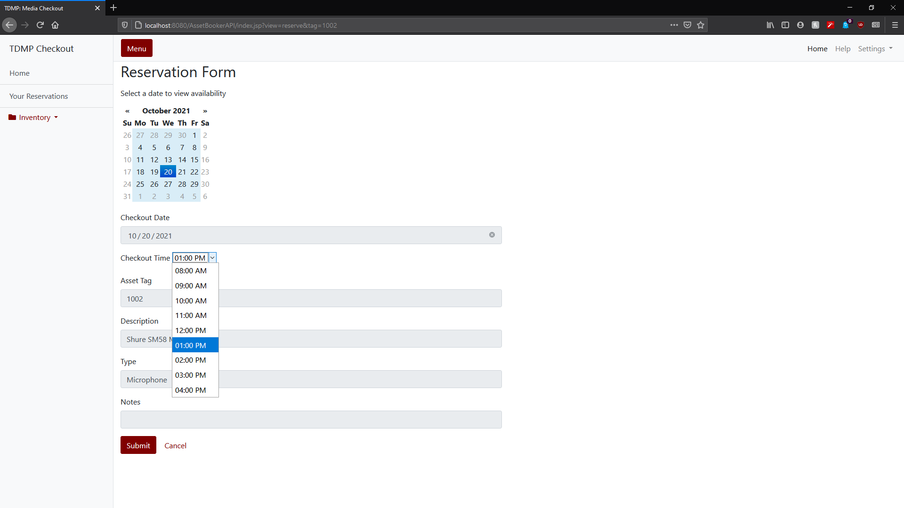

# AssetBooker

AssetBooker is a RESTful web service that combines asset-tracking capabilites with functionality for reserving and checking out assets. 

The client uses a bootstrap template with custom HTML, CSS and JavaScript. The back-end is built with Java, using the JAX-RS specification to expose HTTP methods, a service layer to handle business logic, and a model layer to interface with the database. 

# Screenshots

## Asset list

## Reservation Form

## Reservation list

