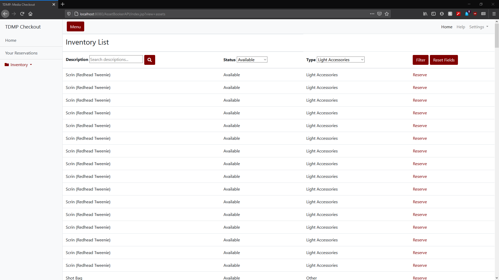
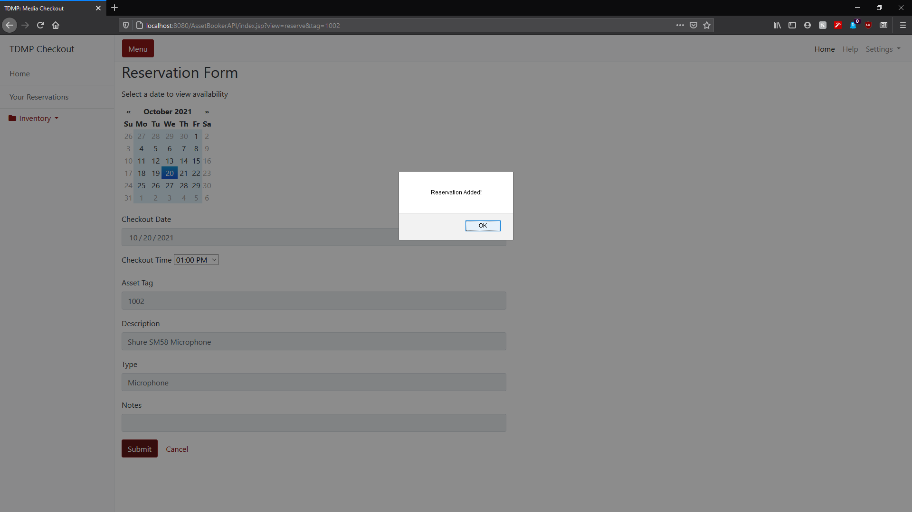
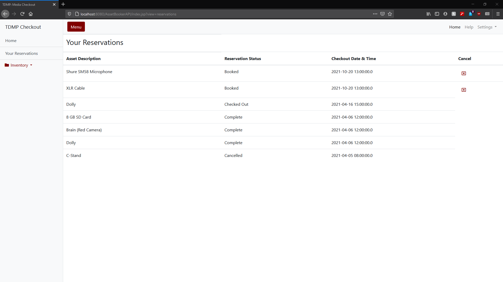

# AssetBooker

AssetBooker is a RESTful web service that combines asset-tracking capabilites with functionality for reserving and checking out assets. 

The back-end is built with Java EE, JAX-RS and (currently) a MSSQL Server database connection, while the front end is bult with HTML, CSS, and Javascript. 

This project is currently being designed for use by the Television and Digital Media Production department of my school, but it is flexible and capable of being adapted to different uses. 

# Screenshots

## Asset list

## Reservation Form

## Reservation list

